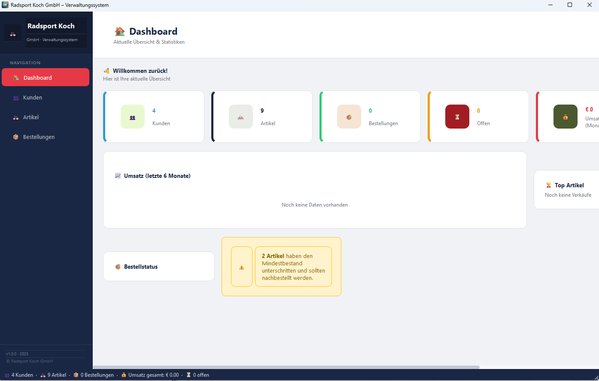
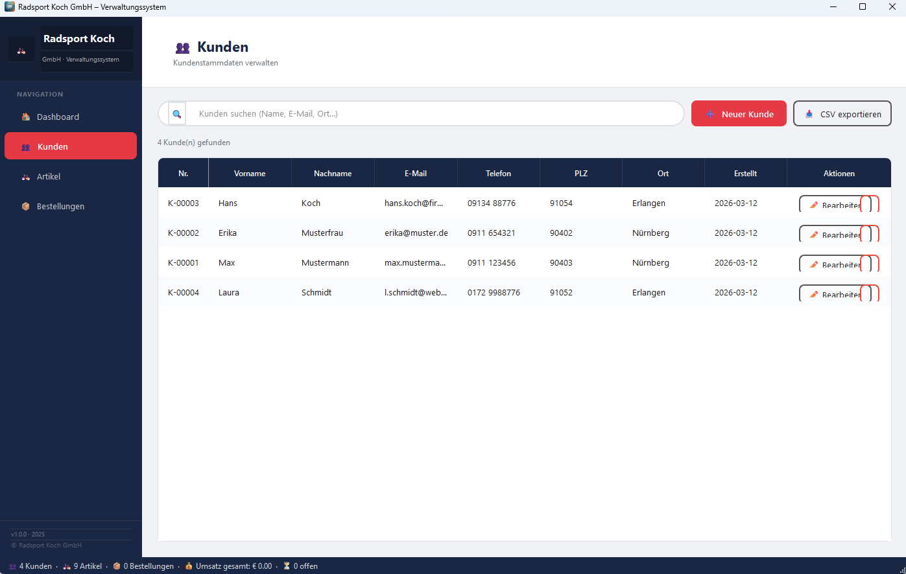
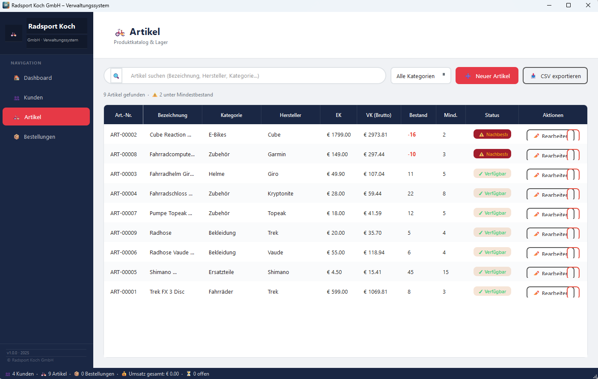
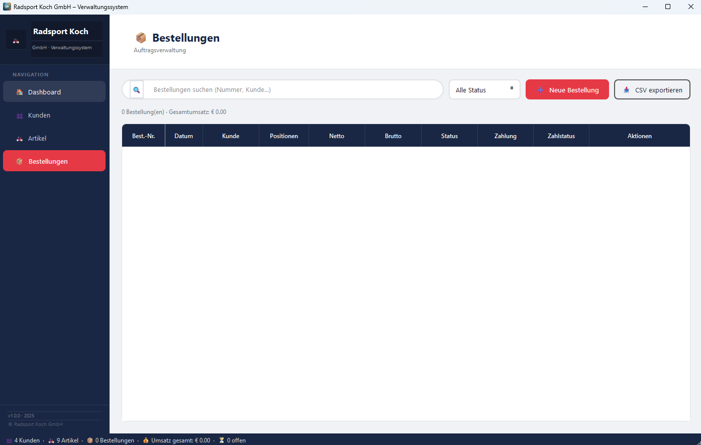

# 🚲 Radsport Koch GmbH – Verwaltungssystem

> A professional desktop management application for a bicycle retail business,
> built with **Python 3.10+**, **PyQt6**, and **SQLite**.  
> Manages customers, products, orders, and live business statistics — all without
> an internet connection or an external database server.

---

## 📸 Screenshots

| Dashboard | Customers |
|-----------|-----------|
|  |  |

| Products | Orders |
|----------|--------|
|  |  |

---

## ✨ Features

### Core Modules
| Module | Description |
|--------|-------------|
| 🏠 **Dashboard** | Live KPI cards, 6-month revenue bar chart, top-selling products, order-status breakdown — auto-refreshes every 60 seconds |
| 👥 **Customer Management** | Full CRUD with address, contact info, date of birth, notes, and auto-generated customer numbers (K-00001 …) |
| 🚲 **Product Catalogue** | Articles with categories, purchase/sale prices, VAT rate, stock levels, re-order warnings, and status badges |
| 📦 **Order Management** | Multi-line orders with live subtotal, discount, shipping costs, payment status, and a read-only detail view |

### Additional Capabilities
- **Real-time search** across all three list views (filtered as you type)
- **CSV export** for customers, products, and orders — semicolon-delimited, opens directly in Excel
- **Auto-generated document numbers** — K-00001, ART-00001, B-00001
- **Re-order warnings** when stock falls below the configured minimum
- **Foreign-key protection** — customers/products referenced by orders cannot be deleted
- **Colour-coded status badges** for order status and payment status
- **Double-click to edit** in every table
- **Automatic sample data** on first launch so the app is immediately explorable
- **Windows taskbar icon** via `AppUserModelID` fix

---

## 🗂️ Project Structure

The project follows a strict **one class per file** modular architecture.
Every UI class lives in its own dedicated module inside the `SBS/` package
(*Single-class Building System*), making the codebase easy to navigate,
test, and extend independently.

```
verwaltungs_tool/
│
├── main.py                  # Entry point — bootstraps Qt, icon, DB, event loop
├── database.py              # Data-access layer — all SQLite queries
├── styles.py                # Centralised colour constants & Qt stylesheet
│
├── assets/
│   ├── app_icon.png         # Application icon (taskbar & title bar)
│   └── screenshots/         # README screenshots
│
├── data/
│   ├── schema.sql           # Database schema & seed data (CREATE TABLE + INSERT)
│   └── radsport_koch.db     # SQLite database file (auto-created on first run)
│
└── SBS/                     # One class per file — the full UI layer
    ├── __init__.py
    ├── _utils.py            # Shared helper (colour badge factory)
    │
    ├── NavButton.py         # Sidebar navigation button
    ├── Sidebar.py           # Left navigation panel
    ├── PageHeader.py        # Per-page title bar
    ├── MainWindow.py        # Main application window (lazy-loads pages)
    │
    ├── StatCard.py          # Dashboard KPI card
    ├── MiniChart.py         # Revenue bar chart (pure PyQt6, no matplotlib)
    ├── TopArtikelWidget.py  # Top-selling products list
    ├── StatusVerteilungWidget.py  # Order-status breakdown
    ├── DashboardWidget.py   # Dashboard page — assembles all cards & charts
    │
    ├── KundeDialog.py       # Create / edit customer dialog
    ├── KundenWidget.py      # Customer list page
    │
    ├── ArtikelDialog.py     # Create / edit product dialog
    ├── ArtikelWidget.py     # Product catalogue page
    │
    ├── PositionenTabelle.py      # Order line-item entry widget
    ├── BestellungDialog.py       # Create / edit order dialog
    ├── BestellungDetailDialog.py # Read-only order detail view
    └── BestellungenWidget.py     # Order list page
```

---

## 🛠️ Setup & Execution

### Prerequisites

| Requirement | Version |
|-------------|---------|
| Python | 3.10 or newer |
| PyQt6 | latest |

### 1 — Install the dependency

```bash
pip install PyQt6
```

No other third-party packages are required. The database is SQLite, which is
part of Python's standard library.

### 2 — Run the application

```bash
cd verwaltungs_tool
python main.py
```

The SQLite database (`data/radsport_koch.db`) and all tables are created
automatically on the first start. Sample data is inserted so the application
is immediately usable.

---

## 🗄️ Database Schema

```
kunden                      — Customer master data
kategorien                  — Product categories
artikel                     — Product catalogue
bestellungen                — Order headers
bestellpositionen           — Individual order line items

── Views (pre-computed for fast queries) ──
v_bestellungen_uebersicht   — Orders joined with customer data and totals
v_artikel_uebersicht        — Products joined with category name and stock status
```

---

## 🧰 Technology Stack

| Technology | Role |
|------------|------|
| **Python 3.10+** | Application language |
| **PyQt6** | Desktop GUI framework |
| **SQLite 3** | Embedded, file-based database — no server required |
| **SQL Views** | Pre-computed aggregations for dashboard statistics |

---

## 💡 Usage Tips

| Action | How |
|--------|-----|
| Create a record | Click **➕ New …** in the toolbar |
| Edit a record | Double-click a row **or** click **✏️ Edit** |
| Delete a record | Click **🗑️** — protected if the record is referenced by an order |
| Search | Type in the search bar — results filter in real time |
| Filter products by category | Use the category dropdown next to the search bar |
| Export to Excel | Click **📥 CSV Export** — opens directly in Excel |
| Change order status | Open order details via 🔍 and update status inline |

---

## 📄 Development Note

> This project was developed, polished, and refactored with the assistance
> of Artificial Intelligence.
